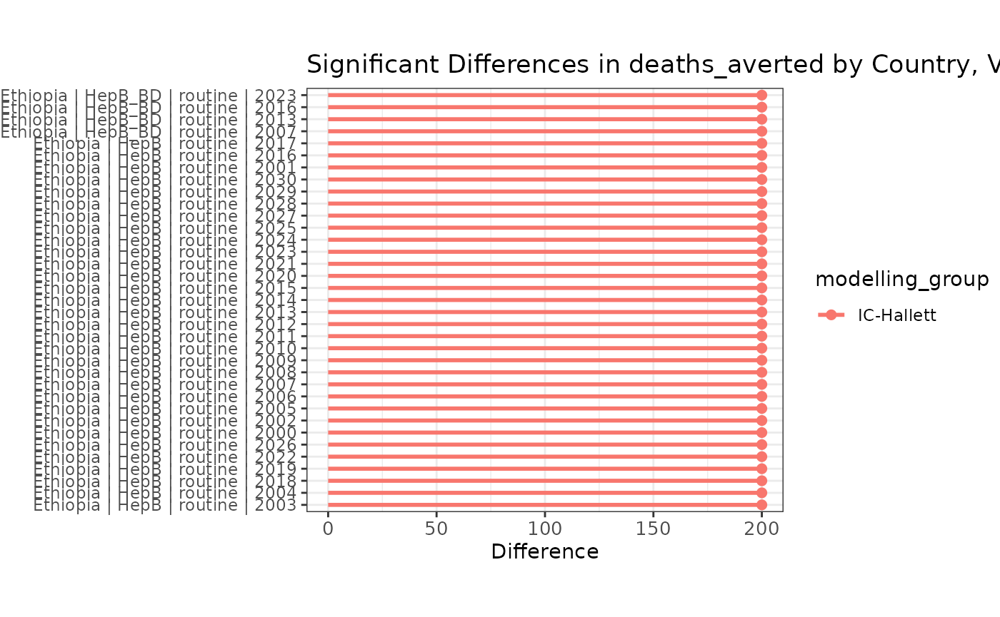
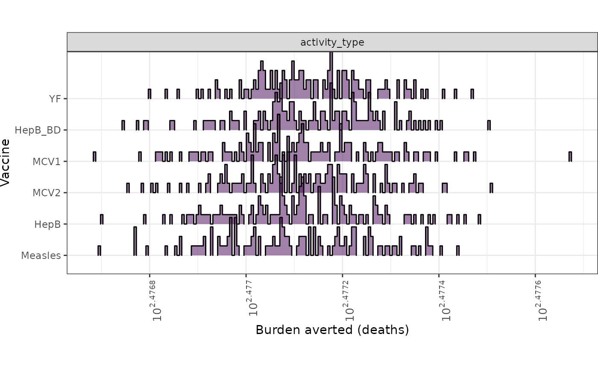
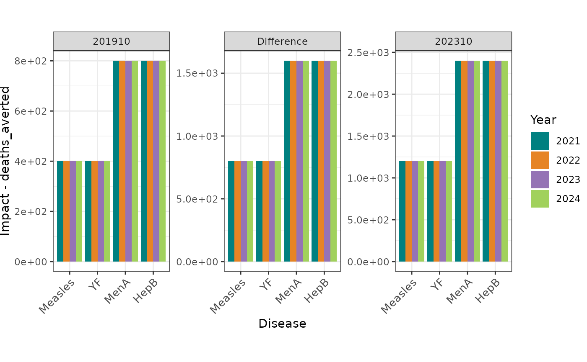
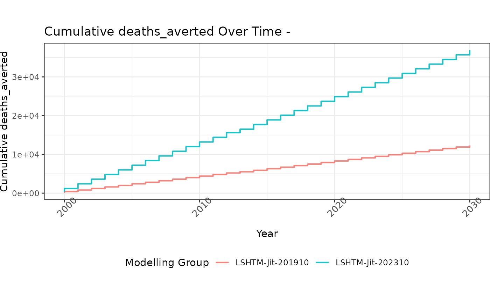

# Pressure testing functions

This vignette shows how to use functions added from the pressure testing
report.

``` r

library(vimcheck)
library(dplyr)
#> 
#> Attaching package: 'dplyr'
#> The following objects are masked from 'package:stats':
#> 
#>     filter, lag
#> The following objects are masked from 'package:base':
#> 
#>     intersect, setdiff, setequal, union
library(tidyr)
```

## Example data

Example impact data are taken from
[*vimpact*](https://github.com/vimc/vimpact) and included in the package
as `eg_impact`. This dataset holds projections for four countries, four
diseases, and three modelling groups; combinations are shown below.

``` r

eg_impact
#> # A tibble: 5,396 × 9
#>    modelling_group country  year vaccine activity_type burden_outcome     impact
#>    <chr>           <chr>   <int> <chr>   <chr>         <chr>               <dbl>
#>  1 IC-Garske       ETH      2000 YF      campaign      deaths_averted          0
#>  2 IC-Garske       ETH      2000 YF      campaign      deaths_averted_ra…     NA
#>  3 IC-Garske       ETH      2000 YF      campaign      cases_averted           0
#>  4 IC-Garske       ETH      2000 YF      campaign      cases_averted_rate     NA
#>  5 IC-Garske       ETH      2000 YF      campaign      dalys_averted           0
#>  6 IC-Garske       ETH      2000 YF      campaign      dalys_averted_rate     NA
#>  7 IC-Garske       ETH      2001 YF      campaign      deaths_averted          0
#>  8 IC-Garske       ETH      2001 YF      campaign      deaths_averted_ra…     NA
#>  9 IC-Garske       ETH      2001 YF      campaign      cases_averted           0
#> 10 IC-Garske       ETH      2001 YF      campaign      cases_averted_rate     NA
#> # ℹ 5,386 more rows
#> # ℹ 2 more variables: disease <chr>, country_name <chr>

# check combinations
distinct(eg_impact, country_name, disease, modelling_group)
#> # A tibble: 14 × 3
#>    country_name disease modelling_group
#>    <chr>        <chr>   <chr>          
#>  1 Ethiopia     YF      IC-Garske      
#>  2 Nigeria      YF      IC-Garske      
#>  3 Ethiopia     HepB    IC-Hallett     
#>  4 India        HepB    IC-Hallett     
#>  5 Nigeria      HepB    IC-Hallett     
#>  6 Pakistan     HepB    IC-Hallett     
#>  7 Ethiopia     MenA    LSHTM-Jit      
#>  8 India        MenA    LSHTM-Jit      
#>  9 Nigeria      MenA    LSHTM-Jit      
#> 10 Pakistan     MenA    LSHTM-Jit      
#> 11 Ethiopia     Measles LSHTM-Jit      
#> 12 India        Measles LSHTM-Jit      
#> 13 Nigeria      Measles LSHTM-Jit      
#> 14 Pakistan     Measles LSHTM-Jit
```

Data on WHO regions is provided as `who_subregions` to enable comparing
countries with their regions.

``` r

who_subregions
#> # A tibble: 249 × 9
#>    choice_subregion country_name      country Global.Name Region.Name Sub.region
#>    <chr>            <chr>             <chr>   <chr>       <chr>       <chr>     
#>  1 EMR D            Afghanistan       AFG     World       Asia        Southern …
#>  2 AFR D            Angola            AGO     World       Africa      Sub-Sahar…
#>  3 EUR B            Albania           ALB     World       Europe      Southern …
#>  4 EUR A            Andorra           AND     World       Europe      Southern …
#>  5 EMR B            United Arab Emir… ARE     World       Asia        Western A…
#>  6 AMR B            Argentina         ARG     World       Americas    Latin Ame…
#>  7 EUR B            Armenia           ARM     World       Asia        Western A…
#>  8 AMR B            Antigua and Barb… ATG     World       Americas    Latin Ame…
#>  9 WPR A            Australia         AUS     World       Oceania     Australia…
#> 10 EUR A            Austria           AUT     World       Europe      Western E…
#> # ℹ 239 more rows
#> # ℹ 3 more variables: Intermediate.Region.Name <chr>, subregion <chr>,
#> #   vimc117 <dbl>
```

## Filtering impact data

Impact data can be filtered, or flagged for filtering, in different
ways.

### Filtering on touchstone

Data can be filtered on touchstone using
[`filter_recent_ts()`](https://vimc.github.io/vimcheck/reference/filter_impact_data.md);
rows with `scenario_type` matching “default” are retained.

Some useful default touchstone values are `DEF_TOUCHSTONE_NEW` (202310),
`DEF_TOUCHSTONE_OLD` (201910), and `DEF_TOUCHSTONE_OLD_OLD` (202110)

``` r

# assign dummy touchstones and scenario type for demo
df <- eg_impact
df$touchstone <- "202401"

test_scenario_types <- rep(
  c("default", "dummy"),
  each = nrow(df) / 2
)
df$scenario_type <- test_scenario_types

# use a package default touchstone
DEF_TOUCHSTONE_NEW
#> [1] "202310"

# touchstone filtering is applied to all non-default scenario rows
filter_recent_ts(df, DEF_TOUCHSTONE_NEW)
#> # A tibble: 2,698 × 11
#>    modelling_group country  year vaccine activity_type burden_outcome     impact
#>    <chr>           <chr>   <int> <chr>   <chr>         <chr>               <dbl>
#>  1 IC-Garske       ETH      2000 YF      campaign      deaths_averted          0
#>  2 IC-Garske       ETH      2000 YF      campaign      deaths_averted_ra…     NA
#>  3 IC-Garske       ETH      2000 YF      campaign      cases_averted           0
#>  4 IC-Garske       ETH      2000 YF      campaign      cases_averted_rate     NA
#>  5 IC-Garske       ETH      2000 YF      campaign      dalys_averted           0
#>  6 IC-Garske       ETH      2000 YF      campaign      dalys_averted_rate     NA
#>  7 IC-Garske       ETH      2001 YF      campaign      deaths_averted          0
#>  8 IC-Garske       ETH      2001 YF      campaign      deaths_averted_ra…     NA
#>  9 IC-Garske       ETH      2001 YF      campaign      cases_averted           0
#> 10 IC-Garske       ETH      2001 YF      campaign      cases_averted_rate     NA
#> # ℹ 2,688 more rows
#> # ℹ 4 more variables: disease <chr>, country_name <chr>, touchstone <chr>,
#> #   scenario_type <chr>
```

### Filtering on diseases

Data can be filtered to exclude a fixed set of diseases, if the
touchstone is older than a threshold value, using
[`filter_excluded_diseases_ts()`](https://vimc.github.io/vimcheck/reference/filter_impact_data.md).

The excluded diseases are stored as the package constant
`EXCLUDED_DISEASES` ().

``` r

# make a copy and add dummy disease values
df_copy <- df
df_copy$disease <- rep(
  EXCLUDED_DISEASES, each = nrow(df_copy) / length(EXCLUDED_DISEASES)
)

# pass dummy touchstone to filter out all rows
filter_excluded_diseases_ts(df_copy, "202501")
#> # A tibble: 0 × 11
#> # ℹ 11 variables: modelling_group <chr>, country <chr>, year <int>,
#> #   vaccine <chr>, activity_type <chr>, burden_outcome <chr>, impact <dbl>,
#> #   disease <chr>, country_name <chr>, touchstone <chr>, scenario_type <chr>
```

### Flagging duplicates

Duplicated rows in the data can be identifier by adding a flag variable
column `n_key`, using
[`flag_duplicates()`](https://vimc.github.io/vimcheck/reference/filter_impact_data.md).

Duplicates are identified across columns specified by the argument
`key_cols`, which defaults to .

``` r

# view n_keys column
flag_duplicates(eg_impact) %>%
  select(
    modelling_group, country, disease, burden_outcome,
    vaccine, activity_type, year, n_key
  )
#> Warning: 1860 duplicates found in data; please check for plausibility!
#> # A tibble: 5,396 × 8
#>    modelling_group country disease burden_outcome    vaccine activity_type  year
#>    <chr>           <chr>   <chr>   <chr>             <chr>   <chr>         <int>
#>  1 IC-Garske       ETH     YF      deaths_averted    YF      campaign       2000
#>  2 IC-Garske       ETH     YF      deaths_averted_r… YF      campaign       2000
#>  3 IC-Garske       ETH     YF      cases_averted     YF      campaign       2000
#>  4 IC-Garske       ETH     YF      cases_averted_ra… YF      campaign       2000
#>  5 IC-Garske       ETH     YF      dalys_averted     YF      campaign       2000
#>  6 IC-Garske       ETH     YF      dalys_averted_ra… YF      campaign       2000
#>  7 IC-Garske       ETH     YF      deaths_averted    YF      campaign       2001
#>  8 IC-Garske       ETH     YF      deaths_averted_r… YF      campaign       2001
#>  9 IC-Garske       ETH     YF      cases_averted     YF      campaign       2001
#> 10 IC-Garske       ETH     YF      cases_averted_ra… YF      campaign       2001
#> # ℹ 5,386 more rows
#> # ℹ 1 more variable: n_key <int>
```

### Filtering invalid trajectories

The function
[`filter_invalid_trajectories()`](https://vimc.github.io/vimcheck/reference/filter_impact_data.md)
can be used to remove rows where outcome values are missing in one of
two paired datasets (each ideally from a different touchstone).

This function should be applied to data which has the impact outcomes as
columns (i.e., in wide format), with duplicates removed.

The outcome to check is specified by the argument `"outcome"`.

``` r

# create some dummy data from exampled data
prev_df <- flag_duplicates(eg_impact)
#> Warning: 1860 duplicates found in data; please check for plausibility!
prev_df <- dplyr::filter(prev_df, n_key == 1)
prev_df <- tidyr::pivot_wider(
  prev_df,
  id_cols = {{ COLNAMES_KEY_PRESSURE_TEST }},
  names_from = "burden_outcome",
  values_from = "impact"
)

# will be replaced by proportion of GAVI support in future
prev_df$support_type <- "other"
rows <- nrow(prev_df)
prev_df$coverage <- 0.5

prev_df$deaths_averted <- withr::with_seed(
  1, sample(c(5e2, NA_real_), rows, TRUE)
)
prev_df$dalys_averted <- withr::with_seed(
  1, sample(c(5e5, NA_real_), rows, TRUE)
)

# assign dummy values
curr_df <- prev_df
curr_df$deaths_averted <- 1e3
curr_df$dalys_averted <- 1e6

# View data with invalid trajectories removed
filter_invalid_trajectories(prev_df, curr_df, "deaths_averted")
#> # A tibble: 369 × 9
#>    country country_name vaccine activity_type  year disease modelling_group
#>    <chr>   <chr>        <chr>   <chr>         <int> <chr>   <chr>          
#>  1 ETH     Ethiopia     YF      campaign       2001 YF      IC-Garske      
#>  2 ETH     Ethiopia     YF      campaign       2004 YF      IC-Garske      
#>  3 ETH     Ethiopia     YF      campaign       2008 YF      IC-Garske      
#>  4 ETH     Ethiopia     YF      campaign       2009 YF      IC-Garske      
#>  5 ETH     Ethiopia     YF      campaign       2015 YF      IC-Garske      
#>  6 ETH     Ethiopia     YF      campaign       2016 YF      IC-Garske      
#>  7 ETH     Ethiopia     YF      campaign       2017 YF      IC-Garske      
#>  8 ETH     Ethiopia     YF      campaign       2018 YF      IC-Garske      
#>  9 ETH     Ethiopia     YF      campaign       2026 YF      IC-Garske      
#> 10 ETH     Ethiopia     YF      campaign       2029 YF      IC-Garske      
#> # ℹ 359 more rows
#> # ℹ 2 more variables: outcome_prev <dbl>, outcome_cur <dbl>
```

## Identifying differences between datasets

This section provides a general demonstration of tools that help to
identify differences between two paired datasets.

### Generating differences

The function
[`generate_diffs()`](https://vimc.github.io/vimcheck/reference/generate_diffs.md)
uses the [*diffdf* package](https://cran.r-project.org/package=diffdf)
to identify differences between two data frames. The output is a list of
tibbles with the added column `VARIABLE` for the column examined for
differences, with the baseline and comparator as `BASE` and `COMPARE`.

``` r

# use prev_df from section above
prev_df$deaths_averted <- withr::with_seed(
  1, rnorm(rows, 1e3, 100)
)
prev_df$dalys_averted <- withr::with_seed(
  1, rnorm(rows, 1e6, 100)
)

# assign dummy values
curr_df <- prev_df
curr_df$deaths_averted <- prev_df$deaths_averted * 2
curr_df$dalys_averted <- prev_df$dalys_averted * 2

interest_cols <- c("deaths_averted", "dalys_averted")
difflist <- generate_diffs(
  prev_df,
  curr_df,
  interest_cols
)
#> Warning in diffdf::diffdf(prev_df[, cols_needed], curr_df[, cols_needed], : 
#> Not all Values Compared Equal

# all rows are different - view the output types
names(difflist)
#> [1] "deaths_averted" "dalys_averted"

difflist
#> $deaths_averted
#> # A tibble: 743 × 11
#>    VARIABLE       country country_name vaccine activity_type  year disease
#>  * <chr>          <chr>   <chr>        <chr>   <chr>         <int> <chr>  
#>  1 deaths_averted ETH     Ethiopia     HepB    routine        2000 HepB   
#>  2 deaths_averted ETH     Ethiopia     HepB    routine        2001 HepB   
#>  3 deaths_averted ETH     Ethiopia     HepB    routine        2002 HepB   
#>  4 deaths_averted ETH     Ethiopia     HepB    routine        2003 HepB   
#>  5 deaths_averted ETH     Ethiopia     HepB    routine        2004 HepB   
#>  6 deaths_averted ETH     Ethiopia     HepB    routine        2005 HepB   
#>  7 deaths_averted ETH     Ethiopia     HepB    routine        2006 HepB   
#>  8 deaths_averted ETH     Ethiopia     HepB    routine        2007 HepB   
#>  9 deaths_averted ETH     Ethiopia     HepB    routine        2008 HepB   
#> 10 deaths_averted ETH     Ethiopia     HepB    routine        2009 HepB   
#> # ℹ 733 more rows
#> # ℹ 4 more variables: modelling_group <chr>, campaign_id <int>, BASE <dbl>,
#> #   COMPARE <dbl>
#> 
#> $dalys_averted
#> # A tibble: 743 × 11
#>    VARIABLE      country country_name vaccine activity_type  year disease
#>  * <chr>         <chr>   <chr>        <chr>   <chr>         <int> <chr>  
#>  1 dalys_averted ETH     Ethiopia     HepB    routine        2000 HepB   
#>  2 dalys_averted ETH     Ethiopia     HepB    routine        2001 HepB   
#>  3 dalys_averted ETH     Ethiopia     HepB    routine        2002 HepB   
#>  4 dalys_averted ETH     Ethiopia     HepB    routine        2003 HepB   
#>  5 dalys_averted ETH     Ethiopia     HepB    routine        2004 HepB   
#>  6 dalys_averted ETH     Ethiopia     HepB    routine        2005 HepB   
#>  7 dalys_averted ETH     Ethiopia     HepB    routine        2006 HepB   
#>  8 dalys_averted ETH     Ethiopia     HepB    routine        2007 HepB   
#>  9 dalys_averted ETH     Ethiopia     HepB    routine        2008 HepB   
#> 10 dalys_averted ETH     Ethiopia     HepB    routine        2009 HepB   
#> # ℹ 733 more rows
#> # ℹ 4 more variables: modelling_group <chr>, campaign_id <int>, BASE <dbl>,
#> #   COMPARE <dbl>
```

### Generate national IQRs

The function `generate_national_iqr()` generates the inter-quartile
range of the impact outcome for a dataset.

``` r

# assign dummy values to check functionality
df <- prev_df
df$deaths_averted <- withr::with_seed(
  1, rnorm(rows, 1e3, 100)
)

iqr_df <- gen_national_iqr(df, value_cols = "deaths_averted")

iqr_df
#> # A tibble: 24 × 4
#>    country vaccine activity_type national_iqr_deaths_averted
#>    <chr>   <chr>   <chr>                               <dbl>
#>  1 ETH     HepB    routine                              102.
#>  2 ETH     HepB_BD routine                              112.
#>  3 ETH     MCV1    routine                              163.
#>  4 ETH     MCV2    routine                              117.
#>  5 ETH     Measles campaign                             148.
#>  6 ETH     YF      campaign                             115.
#>  7 ETH     YF      routine                              116.
#>  8 IND     HepB    routine                              129.
#>  9 IND     HepB_BD routine                              133.
#> 10 IND     MCV1    routine                              125.
#> # ℹ 14 more rows
```

### Flag large differences

The function
[`flag_large_diffs()`](https://vimc.github.io/vimcheck/reference/flag_large_diffs.md)
can be used with the outputs of
[`generate_diffs()`](https://vimc.github.io/vimcheck/reference/generate_diffs.md)
and
[`gen_national_iqr()`](https://vimc.github.io/vimcheck/reference/gen_national_iqr.md)
to find rows where the impact estimate is outside the range expected,
given the IQR.

``` r

# assign some dummy values that will trigger flagging
difflist2 <- difflist
difflist2$deaths_averted$COMPARE <- 1e9 # typical values for BASE are ~1000

# all rows are flagged as having differences > IQR
flag_large_diffs(difflist2, iqr_df, "deaths_averted")
#> # A tibble: 743 × 9
#>    country country_name  year vaccine modelling_group activity_type `202110`
#>    <chr>   <chr>        <int> <chr>   <chr>           <chr>            <dbl>
#>  1 NGA     Nigeria       2011 MCV1    LSHTM-Jit       routine           699.
#>  2 IND     India         2004 Measles LSHTM-Jit       campaign          706.
#>  3 PAK     Pakistan      2014 HepB    IC-Hallett      routine           711.
#>  4 PAK     Pakistan      2019 HepB_BD IC-Hallett      routine           741.
#>  5 ETH     Ethiopia      2014 MCV2    LSHTM-Jit       routine           747.
#>  6 NGA     Nigeria       2015 Measles LSHTM-Jit       campaign          756.
#>  7 ETH     Ethiopia      2020 Measles LSHTM-Jit       campaign          757.
#>  8 PAK     Pakistan      2003 Measles LSHTM-Jit       campaign          759.
#>  9 ETH     Ethiopia      2008 HepB_BD IC-Hallett      routine           760.
#> 10 NGA     Nigeria       2015 MCV1    LSHTM-Jit       routine           766.
#> # ℹ 733 more rows
#> # ℹ 2 more variables: `202310` <dbl>, diff <dbl>
```

### Generate a combined dataset

[`gen_combined_df()`](https://vimc.github.io/vimcheck/reference/gen_combined_df.md)
can be used to generate a combined dataset across two different
touchstones.

``` r

# regenerate data
prev_df <- flag_duplicates(eg_impact)
#> Warning: 1860 duplicates found in data; please check for plausibility!
prev_df <- dplyr::filter(prev_df, n_key == 1)
prev_df <- tidyr::pivot_wider(
  prev_df,
  id_cols = {{ COLNAMES_KEY_PRESSURE_TEST }},
  names_from = "burden_outcome",
  values_from = "impact"
)
prev_df$support_type <- "other" # unsure what values this can take
prev_df$coverage <- 0.5
prev_df$fvps <- 1e6
prev_df$target_population <- 2e6
prev_df$touchstone <- "202010"

# assign dummy values
curr_df <- prev_df
curr_df$deaths_averted <- 1e6
curr_df$dalys_averted <- 1e9
curr_df$touchstone <- "202110"

gen_combined_df(prev_df, curr_df)
#> # A tibble: 743 × 11
#>    country country_name disease vaccine activity_type  year modelling_group
#>    <chr>   <chr>        <chr>   <chr>   <chr>         <int> <chr>          
#>  1 ETH     Ethiopia     YF      YF      campaign       2000 IC-Garske      
#>  2 ETH     Ethiopia     YF      YF      campaign       2001 IC-Garske      
#>  3 ETH     Ethiopia     YF      YF      campaign       2002 IC-Garske      
#>  4 ETH     Ethiopia     YF      YF      campaign       2003 IC-Garske      
#>  5 ETH     Ethiopia     YF      YF      campaign       2004 IC-Garske      
#>  6 ETH     Ethiopia     YF      YF      campaign       2005 IC-Garske      
#>  7 ETH     Ethiopia     YF      YF      campaign       2006 IC-Garske      
#>  8 ETH     Ethiopia     YF      YF      campaign       2007 IC-Garske      
#>  9 ETH     Ethiopia     YF      YF      campaign       2008 IC-Garske      
#> 10 ETH     Ethiopia     YF      YF      campaign       2009 IC-Garske      
#> # ℹ 733 more rows
#> # ℹ 4 more variables: deaths_averted_old <dbl>, deaths_averted_new <dbl>,
#> #   dalys_averted_old <dbl>, dalys_averted_new <dbl>
```

## Comparing national values to regional values

[`compare_natl_subreg()`](https://vimc.github.io/vimcheck/reference/compare_natl_subreg.md)
allows comparing national impact rates with regional rates, where
regions are the WHO regions.

There is no example for this functionality as yet.

## Plotting functions

This section covers plotting functions.

First we prepare some dummy data for plotting.

``` r

# preparatory code with dummy data
prev_df <- flag_duplicates(eg_impact)
#> Warning: 1860 duplicates found in data; please check for plausibility!
prev_df <- dplyr::filter(prev_df, n_key == 1)
prev_df <- tidyr::pivot_wider(
  prev_df,
  id_cols = {{ COLNAMES_KEY_PRESSURE_TEST }},
  names_from = "burden_outcome",
  values_from = "impact"
)
prev_df$support_type <- "other" # unsure what values this can take
prev_df$coverage <- 0.5
prev_df$fvps <- 1e6
prev_df$target_population <- 2e6

prev_df$deaths_averted <- withr::with_seed(
  1,
  rnorm(nrow(prev_df), 100, 0.1)
)
prev_df$dalys_averted <- prev_df$deaths_averted * 100
prev_df$touchstone <- "202010"

# assign dummy values
curr_df <- prev_df
curr_df$deaths_averted <- withr::with_seed(
  1,
  rnorm(nrow(prev_df), 300, 0.1)
)
curr_df$dalys_averted <- curr_df$deaths_averted * 100
curr_df$touchstone <- "202110"

interest_cols <- c("deaths_averted", "dalys_averted")
changes <- generate_diffs(
  prev_df,
  curr_df,
  interest_cols
)
#> Warning in diffdf::diffdf(prev_df[, cols_needed], curr_df[, cols_needed], : 
#> Not all Values Compared Equal

# national IQR - inset dummy values for tests
national_iqr <- gen_national_iqr(prev_df)
national_iqr$national_iqr_deaths_averted <- seq_len(nrow(national_iqr))
```

### Plotting significant differences

Find and flag large diffs using
[`flag_large_diffs()`](https://vimc.github.io/vimcheck/reference/flag_large_diffs.md)
and visualise the output using
[`plot_sig_diff()`](https://vimc.github.io/vimcheck/reference/plot_impact_diagnostics.md).

``` r

flag_large_diffs(changes, national_iqr) |>
  plot_sig_diff()
```



### Plotting modelling group variation

Visualise variation in impact by modelling group using
[`plot_modelling_group_variation()`](https://vimc.github.io/vimcheck/reference/plot_impact_diagnostics.md).

Data should be prepared using
[`prep_plot_mod_grp_varn()`](https://vimc.github.io/vimcheck/reference/plot_prep_impact_diagnostics.md)
first.

``` r

prev_df_copy <- dplyr::select(curr_df, vaccine, modelling_group) %>%
  dplyr::distinct() %>%
  dplyr::group_by(vaccine) %>%
  dplyr::mutate(mod_num = dplyr::row_number())

prep_plot_mod_grp_varn(curr_df, prev_df_copy) |>
  plot_modelling_group_variation()
```



### Plotting GAVI vaccination

Use
[`plot_vaccine_gavi()`](https://vimc.github.io/vimcheck/reference/plot_impact_diagnostics.md)
on data that has been prepared using
[`prep_plot_vax_gavi()`](https://vimc.github.io/vimcheck/reference/plot_prep_impact_diagnostics.md).

``` r

prep_plot_vax_gavi(curr_df, prev_df, "deaths_averted") |>
  plot_vaccine_gavi()
```



### Plot cumulative values

Use
[`plot_cumul()`](https://vimc.github.io/vimcheck/reference/plot_impact_diagnostics.md)
on data prepared using
[`prep_plot_cumul()`](https://vimc.github.io/vimcheck/reference/plot_prep_impact_diagnostics.md)
and
[`gen_combined_df()`](https://vimc.github.io/vimcheck/reference/gen_combined_df.md).

``` r

gen_combined_df(prev_df, curr_df) |>
  prep_plot_cumul("deaths_averted", "Measles") |>
  plot_cumul()
#> Warning: There were 62 warnings in `dplyr::summarise()`.
#> The first warning was:
#> ℹ In argument: `avg_deaths_averted = mean(...)`.
#> ℹ In group 1: `year = 2000`, `touchstone = 201910`.
#> Caused by warning in `mean.default()`:
#> ! argument is not numeric or logical: returning NA
#> ℹ Run `dplyr::last_dplyr_warnings()` to see the 61 remaining warnings.
```


